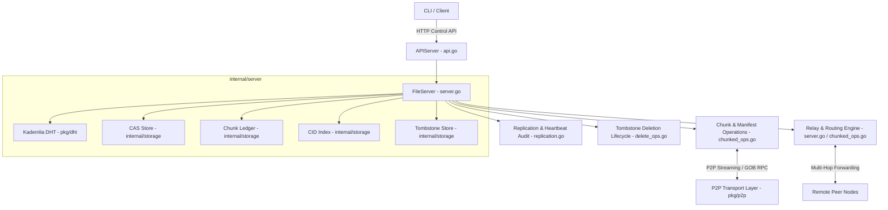

# GO-DFS Server (`internal/server`)

The `server` package provides the core node orchestrator and network runtime for **GO-DFS**, a distributed, encrypted, content-addressed P2P file system built in Go.

It brings together Kademlia DHT routing, local content-addressed storage (CAS), peer-to-peer transport streaming, multi-hop relay networking, automated replication health auditing, tombstone-based network deletions, and a loopback HTTP control API for CLI management.

---

## Key Capabilities

- **Content-Addressed Chunked Storage**: Files are encrypted with AES-GCM, hashed into SHA-256 Content Identifiers (CIDs), split into 1MB chunks, and cataloged via GOB-encoded `FileManifest` objects.
- **Zero-Trust Chunk Verification**: Every incoming chunk's payload is hashed and verified against its content key (`verifyChunkHash`) before committing to disk, preventing network data corruption or poisoning attacks.
- **Relay & Multi-Hop Networking**: Facilitates NAT-to-NAT communication through public bootstrap and relay nodes (`RelayOnly=true`) using TTL-bounded envelope forwarding (`MessageRelay`) and raw stream piping (`RelayStreamMeta`).
- **Automated Health & Replication Audit**: Continuously pings peers via heartbeats, tracks latency and session metrics (`PeerHealth`), evicts non-responsive nodes, and enforces replica target constraints (`ReplicaTarget = 3`) through a two-phase audit mechanism.
- **Network-Wide Deletions & Tombstoning**: Implements tombstone persistence (`TombstoneStore`) to safely delete files across distributed peers and synchronizes offline peers on reconnection (`MessageTombstoneSync`).
- **Authenticated Control API**: Exposes a localhost-only HTTP daemon (`127.0.0.1`) secured by API token authentication for command-line file uploads, downloads, peer monitoring, and system metrics.

---

## Package Architecture



---

## File Overview

| File | Primary Responsibilities |
| :--- | :--- |
| [`server.go`](file:///c:/UNIVERSE/Projects/GO-DFS/internal/server/server.go) | Defines `FileServer` and `FileServerOptions`, initializes Kademlia routing and storage subsystems, handles message dispatch (`handleMessage`), discovery loop (`discoveryLoop`), and relay envelope routing (`handleRelay`). |
| [`api.go`](file:///c:/UNIVERSE/Projects/GO-DFS/internal/server/api.go) | Implements `APIServer` loopback HTTP control API (`/api/put`, `/api/get/`, `/api/ls`, `/api/rm/`, `/api/peers`, `/api/status`, `/api/id`, `/api/metrics`) with local token middleware. |
| [`chunked_ops.go`](file:///c:/UNIVERSE/Projects/GO-DFS/internal/server/chunked_ops.go) | Manages `StoreDataChunked` and `GetFileChunked`, parallel chunk retrieval (`fetchChunksParallel`), SHA-256 verification (`verifyChunkHash`), and streaming relay headers (`sendRelayStream`, `handleRelayStream`). |
| [`replication.go`](file:///c:/UNIVERSE/Projects/GO-DFS/internal/server/replication.go) | Executes peer heartbeats (`heartbeatLoop`), `PeerHealth` statistics tracking, dead node eviction (`evictDeadPeer`), two-phase replication auditing (`replicationLoop`, `runReplicationAudit`), and repair mechanisms. |
| [`delete_ops.go`](file:///c:/UNIVERSE/Projects/GO-DFS/internal/server/delete_ops.go) | Manages file tombstoning (`DeleteFile`), local CAS byte cleanup, deletion broadcasting (`MessageDeleteFile`), peer sync (`MessageTombstoneSync`), and background garbage collection (`gcLoop`). |
| [`message.go`](file:///c:/UNIVERSE/Projects/GO-DFS/internal/server/message.go) | Defines and registers GOB protocol payload structures (`MessageStoreFile`, `MessagePeerExchange`, `MessageFindNode`, `MessageBatchChunkQuery`, `FileManifest`, `StorageProfile`, etc.). |
| [`placement.go`](file:///c:/UNIVERSE/Projects/GO-DFS/internal/server/placement.go) | Implements `PlacementOptimizer` for evaluating candidate target nodes (`NodeCandidate`) with fallback to distance-based Kademlia routing. |
| [`metrics.go`](file:///c:/UNIVERSE/Projects/GO-DFS/internal/server/metrics.go) | Provides thread-safe `PlacementMetrics` tracking placement decisions (`PlacementRecord`) and node eviction events (`EvictionRecord`). |
| [`util.go`](file:///c:/UNIVERSE/Projects/GO-DFS/internal/server/util.go) | Helper functions for node identity generation (`LoadOrGenerateNodeID`), network address mapping (`resolvePeerAddr`), and stream decryption (`DecryptStream`). |

---

## Core Subsystems & Technical Details

### 1. Content-Addressed Chunking & Verification ([`chunked_ops.go`](file:///c:/UNIVERSE/Projects/GO-DFS/internal/server/chunked_ops.go))

File storage follows a pipeline:
1. **Encryption**: Input stream `io.Reader` is encrypted using AES-GCM with a user-supplied key and random nonce.
2. **Hashing & Chunking**: The encrypted stream is passed through a `TeeReader` with SHA-256 to calculate the Content Identifier (CID). Simultaneously, `storage.ChunkAndStore` partitions the stream into fixed 1MB chunks (hash-keyed by content).
3. **Manifest Construction**: A `FileManifest` is built listing `OriginalKey`, `TotalSize`, `ChunkSize`, and ordered `ChunkKeys`. The manifest is stored in local CAS as `<CID>.manifest`.
4. **Replication**: The manifest and chunks are distributed to candidate peers.
5. **Parallel Fetching**: Downloading a file (`GetFileChunked`) reads the manifest, identifies missing chunks, and spawns up to 4 concurrent worker goroutines (`fetchChunksParallel`) to retrieve them from nearest DHT peers. Each retrieved chunk hash is validated using `verifyChunkHash`.

### 2. Multi-Hop Relay & NAT Traversal ([`server.go`](file:///c:/UNIVERSE/Projects/GO-DFS/internal/server/server.go), [`chunked_ops.go`](file:///c:/UNIVERSE/Projects/GO-DFS/internal/server/chunked_ops.go))

Nodes behind NAT or firewalls utilize public relay nodes (`RelayOnly=true`):
- **Envelope Relay (`MessageRelay`)**: Control payloads intended for unreachable target nodes are wrapped inside a relay message with a Hop Limit TTL (default: 3). Intermediate nodes inspect `TargetAddr` and forward the message closer to the destination via DHT routing.
- **Streaming Relay (`RelayStreamMeta`)**: Large chunks utilize low-allocation streaming relay connections (`sendRelayStream` / `handleRelayStream`) using pooled 32KB buffers (`relayBufPool`), piping bytes from origin to target without accumulating the full chunk in relay memory.

### 3. Replication Auditing & Node Health ([`replication.go`](file:///c:/UNIVERSE/Projects/GO-DFS/internal/server/replication.go))

Data durability is maintained via automated health checks and audits:
- **Peer Heartbeats**: Every 15 seconds (`DefaultHeartbeatInterval`), nodes send `MessagePing` to all connected peers. Missing 3 consecutive pings (`DefaultFailureThreshold`) triggers node eviction (`evictDeadPeer`) and launches an immediate emergency replication audit.
- **`PeerHealth` Metrics**: Tracks rolling exponential moving average RTT (`AvgRTTMs`), uptime ratio (`UptimeRatio()`), total uptime/downtime, and session counts.
- **Two-Phase Replication Audit**:
  - **Phase 1 (Collection)**: Scans all local chunks from `ChunkLedger` and queries peers using paginated `MessageBatchChunkQuery` (`AuditBatchSize = 500`). Peers return `MessageBatchChunkResponse` detailing held chunks.
  - **Phase 2 (Repair)**: Identifies under-replicated chunks (`count < ReplicaTarget`, default 3) and pushes missing replicas (`handleUnderReplication`). For over-replicated chunks (`count > ReplicaTarget`), it sends `MessageDropChunk` to distant holders while preserving file owner copies (`buildOwnedChunkSet`).

### 4. Tombstone Deletions & Garbage Collection ([`delete_ops.go`](file:///c:/UNIVERSE/Projects/GO-DFS/internal/server/delete_ops.go))

File deletion ensures network-wide propagation:
- **`DeleteFile`**: Loads the file manifest, creates persistent tombstone entries (`storage.Tombstone`) for all chunk keys and the manifest key via `TombstoneStore.Kill()`, removes bytes from disk CAS, updates the ledger and index, and broadcasts `MessageDeleteFile` to network peers.
- **Peer Tombstone Sync**: During peer handshake (`OnPeer`), connected nodes exchange active tombstones via `MessageTombstoneSync` so offline nodes apply missing deletions upon reconnecting.
- **Garbage Collector (`gcLoop`)**: Runs every 10 minutes to clean local disk bytes for tombstoned chunks and purges expired tombstones older than `TombstoneTTL` (30 days).

### 5. Control HTTP API ([`api.go`](file:///c:/UNIVERSE/Projects/GO-DFS/internal/server/api.go))

The `APIServer` runs on a loopback interface (`127.0.0.1`) and authenticates requests using an authorization token (`api_token`) stored in the root data directory.

| Endpoint | Method | Description |
| :--- | :--- | :--- |
| `/api/put` | `POST` | Uploads a multipart file payload, encrypts, chunks, stores in mesh, and returns CID JSON. |
| `/api/get/<CID>` | `GET` | Retrieves chunks for given CID, decrypts, and streams raw file bytes. |
| `/api/ls` | `GET` | Returns JSON array of stored file entries from the local CID index. |
| `/api/rm/<CID>` | `DELETE` | Tombstones file chunks and broadcasts deletion to the network. |
| `/api/peers` | `GET` | Returns list of currently connected P2P peers. |
| `/api/status` | `GET` | Returns peer health statistics, replication audit summary, and node profile. |
| `/api/id` | `GET` | Returns node DHT ID, listen address, data directory, and key configuration status. |
| `/api/metrics` | `GET` | Dumps placement decision records and node eviction history. |

---

## Integration & Example Usage

The snippet below demonstrates programmatically initializing a `FileServer` alongside its `APIServer`:

```go
package main

import (
	"log"
	"path/filepath"

	"github.com/Ankesh2004/GO-DFS/internal/server"
	"github.com/Ankesh2004/GO-DFS/pkg/p2p"
)

func main() {
	rootDir := "./node_data"

	// Generate or load persistent node ID
	nodeID, err := server.LoadOrGenerateNodeID(rootDir)
	if err != nil {
		log.Fatalf("Failed to load node ID: %v", err)
	}

	// Configure P2P transport
	tcpOpts := p2p.TCPTransportOpts{
		ListenAddr:    ":3000",
		HandshakeFunc: p2p.NOPHandshakeFunc,
		Decoder:       p2p.DefaultDecoder{},
	}
	tr := p2p.NewTCPTransport(tcpOpts)

	// Create FileServer instance
	fsOptions := server.FileServerOptions{
		ID:             nodeID,
		RootDir:        rootDir,
		AdvertiseAddr:  "127.0.0.1:3000",
		Transport:      tr,
		BootstrapNodes: []string{},
		RelayOnly:      false,
		StorageProfile: server.StorageProfile{
			Tier:          server.TierSSD,
			LatencyMs:     5.0,
			CostPerGBHour: 0.01,
			AvailableMB:   50000,
			BandwidthMbps: 100.0,
		},
	}

	fs := server.NewFileServer(fsOptions)
	tr.OnPeer = fs.OnPeer

	// Launch HTTP Control API on loopback
	keyPath := filepath.Join(rootDir, "user.key")
	_, err = fs.StartAPI(":9000", keyPath)
	if err != nil {
		log.Fatalf("Failed to start API server: %v", err)
	}

	// Start FileServer network listener and background loops
	log.Println("Starting FileServer...")
	if err := fs.Start(); err != nil {
		log.Fatalf("FileServer error: %v", err)
	}
}
```
