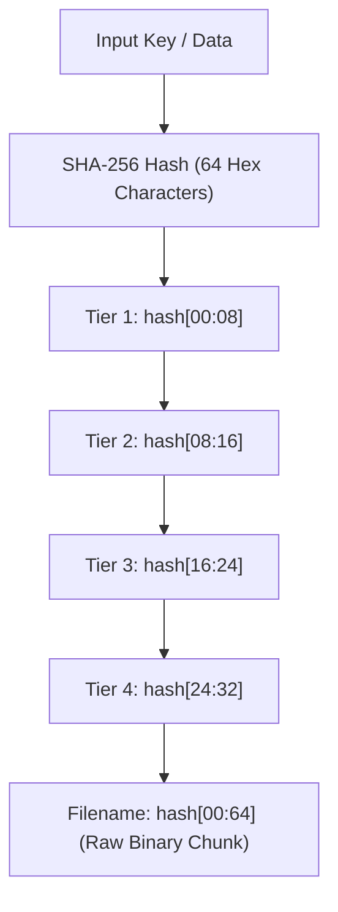
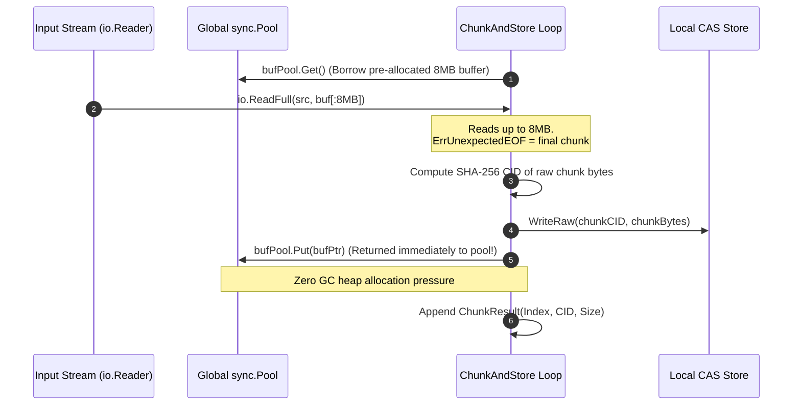
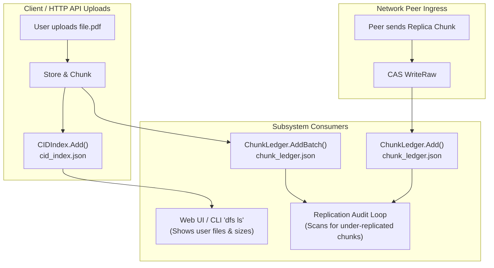
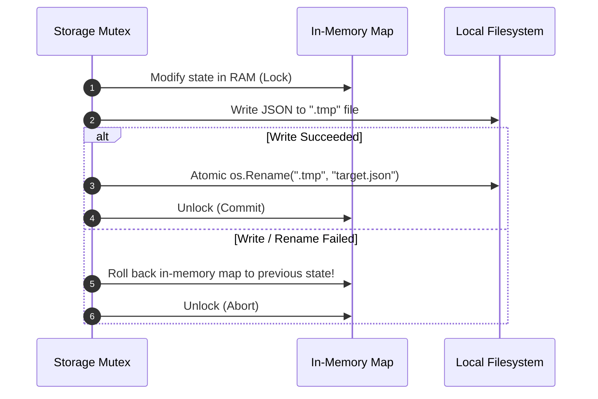
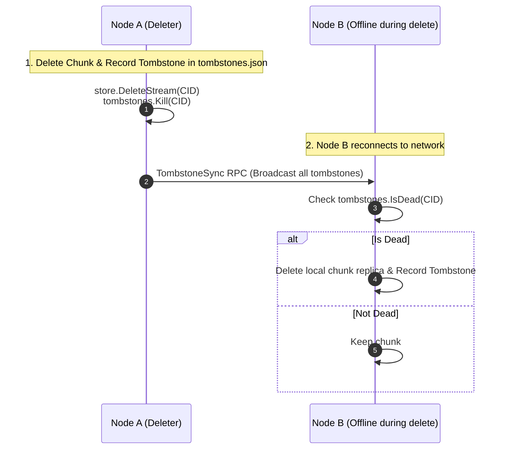

# Storage Package (`internal/storage`)

The `storage` package provides the Content Addressable Storage (CAS) engine, file chunking, local chunk ledgering, CID metadata indexing, and distributed tombstone management for GO-DFS.

## Overview & Architecture

The storage layer is built for distributed, fault-tolerant, zero-trust file storage with optimal OS filesystem performance and data safety:

- **Content Addressable Storage (CAS)**: Files and chunks are hashed using SHA-256. The resulting 64-character hex hash is split into 4 nested directory sub-levels (`hash[0:8]/hash[8:16]/hash[16:24]/hash[24:32]/hash`). This prevents filesystem performance degradation caused by directories containing tens of thousands of individual files.
- **Fixed-Size Chunking (`Chunker`)**: Data streams are partitioned into 8MB chunks (`DefaultChunkSize`), hashed, and persisted to CAS. A global buffer pool (`sync.Pool`) recycles memory allocations to maximize throughput during high-concurrency upload and download workloads.
- **Node-Wide Chunk Ledger (`ChunkLedger`)**: Maintains an index of all chunk keys physically present on disk—including chunks received as network replicas from peer nodes. This ledger is audited by replication background processes to detect under-replication and restore redundant copies across the node network.
- **Local CID Index (`CIDIndex`)**: Tracks file-level metadata (such as CID, original filename, total encrypted size, chunk count, and upload timestamp) for files uploaded by the node.
- **Deletion Journal (`TombstoneStore`)**: Records chunk deletion tombstones with timestamps (`tombstones.json`). Serves as a persistent delete log so disconnected or offline nodes synchronize deletion state when rejoining the network cluster.

---

## 📊 Storage Architecture & Execution Flows

### 1. 4-Level CAS Directory Fanout



### 2. High-Throughput Pooled Chunking Pipeline & Buffer Lifecycle



### 3. CIDIndex vs. ChunkLedger: Scope & Responsibility



### 4. Atomic Index Persistence & In-Memory Rollback



### 5. Distributed Tombstone Anti-Entropy Barrier



---

## 🔍 Deep Dive: Key Mechanical Concepts

### 1. `io.ReadFull` and the `io.ErrUnexpectedEOF` Behavior
When slicing a 20MB file into 8MB chunks:
- **Chunk 0** reads exactly 8,388,608 bytes (`err == nil`).
- **Chunk 1** reads exactly 8,388,608 bytes (`err == nil`).
- **Chunk 2** attempts to read 8MB, but the stream ends after 4,194,304 bytes. `io.ReadFull` returns `n = 4194304` and `err = io.ErrUnexpectedEOF`.
- In standard Go I/O, `ErrUnexpectedEOF` is an error; however, in a chunker, it cleanly indicates that the **final partial chunk was reached**. `ChunkAndStore` gracefully accepts this, persists the remaining bytes, and exits the loop.

### 2. Node-Wide Ledger Rebuilding (`needsRebuild`)
When `NewChunkLedger(rootDir)` runs:
- If `chunk_ledger.json` is missing or corrupted, `load()` returns `needsRebuild = true`.
- The server engine detects this and initiates a directory crawl across the CAS root to re-index all physical chunks existing on disk, ensuring no data is orphaned after a crash.

---

## Key Components & API Reference

### 1. `Store` (CAS Filesystem Manager)
Source: [`store.go`](file:///c:/UNIVERSE/Projects/GO-DFS/internal/storage/store.go)

 Manages content-addressed read, write, and delete operations on the local file system.

| Method | Signature | Description |
| :--- | :--- | :--- |
| `NewStore` | `NewStore(rootDir string) *Store` | Instantiates a CAS store at the specified root path. |
| `GetCASPath` | `GetCASPath(key string) Path` | Computes the 4-level nested CAS directory path from a key hash. |
| `WriteStream` | `WriteStream(key string, r io.Reader) (int64, error)` | Streams data from an `io.Reader` into the CAS hierarchy. |
| `ReadStream` | `ReadStream(key string) (int64, io.ReadCloser, error)` | Opens an `io.ReadCloser` stream for reading a stored key. |
| `DeleteStream` | `DeleteStream(key string) error` | Removes the chunk/file associated with the key from disk. |
| `Has` | `Has(key string) bool` | Checks if a key exists on local disk. |
| `Wipe` | `Wipe() error` | Recursively removes the entire storage root directory. |

---

### 2. `Chunker` & `ChunkResult`
Source: [`chunker.go`](file:///c:/UNIVERSE/Projects/GO-DFS/internal/storage/chunker.go)

Slices data streams into fixed-size chunks and computes SHA-256 content hashes.

- **`DefaultChunkSize`**: `8 * 1024 * 1024` bytes (8 MB).
- **`ChunkResult`**: Struct containing `Index` (0-based chunk order), `ChunkKey` (SHA-256 hex string), and `Size` (bytes written).

| Method / Function | Signature | Description |
| :--- | :--- | :--- |
| `ChunkAndStore` | `(s *Store) ChunkAndStore(src io.Reader, chunkSize int64) ([]ChunkResult, error)` | Reads input stream, writes chunks to CAS, and returns slice of `ChunkResult`. |
| `WriteRaw` | `(s *Store) WriteRaw(key string, data []byte) (int64, error)` | Directly writes raw byte slices into CAS to avoid redundant copying. |
| `ReadChunk` | `(s *Store) ReadChunk(chunkKey string) ([]byte, error)` | Reads raw chunk bytes into a byte slice. |

> [!NOTE]
> In zero-trust encrypted storage, identical plaintext files encrypted with different keys/nonces produce distinct ciphertexts and content hashes. Cross-user deduplication is intentionally avoided to eliminate side-channel privacy vectors.

---

### 3. `ChunkLedger`
Source: [`chunk_ledger.go`](file:///c:/UNIVERSE/Projects/GO-DFS/internal/storage/chunk_ledger.go)

File-backed, thread-safe tracking structure stored at `<rootDir>/chunk_ledger.json`.

| Method | Signature | Description |
| :--- | :--- | :--- |
| `NewChunkLedger` | `NewChunkLedger(rootDir string) (*ChunkLedger, bool)` | Loads existing ledger or returns `needsRebuild=true` if file is missing or corrupted. |
| `Add` | `(cl *ChunkLedger) Add(key string) error` | Registers a single chunk key into the ledger. |
| `AddBatch` | `(cl *ChunkLedger) AddBatch(keys []string) error` | Batch registers multiple chunk keys under a single lock and atomic disk write. |
| `Remove` | `(cl *ChunkLedger) Remove(key string) error` | Unregisters a chunk key from the ledger. |
| `Has` | `(cl *ChunkLedger) Has(key string) bool` | Thread-safe check for chunk presence in ledger. |
| `All` | `(cl *ChunkLedger) All() []string` | Returns a snapshot slice of all tracked chunk keys. |
| `Count` | `(cl *ChunkLedger) Count() int` | Returns total number of registered chunk keys. |

---

### 4. `CIDIndex`
Source: [`cid_index.go`](file:///c:/UNIVERSE/Projects/GO-DFS/internal/storage/cid_index.go)

Local ledger mapping Content Identifiers (CIDs) to file metadata at `<rootDir>/cid_index.json`.

- **`CIDEntry`**: `CID`, `OriginalName`, `Size`, `ChunkCount`, `StoredAt`.

| Method | Signature | Description |
| :--- | :--- | :--- |
| `NewCIDIndex` | `NewCIDIndex(rootDir string) *CIDIndex` | Loads or initializes local CID index. |
| `Add` | `(idx *CIDIndex) Add(entry CIDEntry) error` | Adds/updates a CID record with current RFC3339 timestamp. |
| `List` | `(idx *CIDIndex) List() []CIDEntry` | Returns all recorded file entries. |
| `Remove` | `(idx *CIDIndex) Remove(cid string) error` | Removes a CID record from the index. |

---

### 5. `TombstoneStore` & `Tombstone`
Source: [`tombstone.go`](file:///c:/UNIVERSE/Projects/GO-DFS/internal/storage/tombstone.go)

Persistent delete journal stored at `<rootDir>/tombstones.json`.

- **`Tombstone`**: `ChunkKey`, `DeletedAt`.

| Method | Signature | Description |
| :--- | :--- | :--- |
| `NewTombstoneStore` | `NewTombstoneStore(rootDir string) *TombstoneStore` | Loads or creates the tombstone store. |
| `Kill` | `(ts *TombstoneStore) Kill(chunkKey string) error` | Marks a chunk key as permanently deleted and persists to disk. |
| `IsDead` | `(ts *TombstoneStore) IsDead(chunkKey string) bool` | Checks if a chunk is tombstoned. |
| `All` | `(ts *TombstoneStore) All() []Tombstone` | Returns all tombstones for network peer synchronization. |
| `ApplyBatch` | `(ts *TombstoneStore) ApplyBatch(tombstones []Tombstone) error` | Merges tombstones received from remote peers. |
| `Prune` | `(ts *TombstoneStore) Prune(olderThan time.Time) error` | Removes tombstones older than the specified cutoff timestamp. |

---

## Storage Layout on Disk

```text
<rootDir>/
├── chunk_ledger.json       # Node-wide chunk inventory
├── cid_index.json          # Local file metadata index
├── tombstones.json         # Distributed delete journal
└── 3f/                     # CAS directory level 1 (hash[0:8])
    └── 7a/                 # CAS directory level 2 (hash[8:16])
        └── 9b/             # CAS directory level 3 (hash[16:24])
            └── 2c/         # CAS directory level 4 (hash[24:32])
                └── 3f7a9b2c... # Raw chunk binary payload
```

---

## Fault Tolerance & Persistence Rules

1. **Atomic File Persistence**: All JSON indexes (`chunk_ledger.json`, `cid_index.json`, `tombstones.json`) write updates to a `.tmp` file before executing an atomic rename (`os.Rename`). This prevents corruption during ungraceful shutdowns or host crashes.
2. **In-Memory Rollback**: If disk write/rename fails during index modification (e.g., `Add`, `AddBatch`, `Remove`), in-memory state is automatically rolled back to keep memory synchronized with disk.
3. **Corruption Backup**: If a JSON index is corrupted, `CIDIndex` and `TombstoneStore` automatically preserve the broken file as `<filename>.corrupt` for manual inspection rather than overwriting existing data.
4. **Concurrent Safety**: `sync.RWMutex` locks protect state across concurrent HTTP uploads, background replication worker loops, and P2P synchronization routines.

---

## Code Examples

### 1. Chunking and Persisting a File

```go
package main

import (
	"bytes"
	"fmt"
	"log"

	"GO-DFS/internal/storage"
)

func main() {
	rootDir := "./data_node"
	store := storage.NewStore(rootDir)
	ledger, needsRebuild := storage.NewChunkLedger(rootDir)
	if needsRebuild {
		log.Println("Chunk ledger requires rebuild from disk scan")
	}

	data := bytes.NewReader([]byte("GO-DFS Storage Layer Example Content"))

	// Chunk and write to CAS
	results, err := store.ChunkAndStore(data, storage.DefaultChunkSize)
	if err != nil {
		log.Fatalf("Chunking failed: %v", err)
	}

	// Register stored chunk keys into ledger
	var keys []string
	for _, res := range results {
		fmt.Printf("Chunk %d -> Key: %s (%d bytes)\n", res.Index, res.ChunkKey, res.Size)
		keys = append(keys, res.ChunkKey)
	}

	if err := ledger.AddBatch(keys); err != nil {
		log.Fatalf("Failed to update ledger: %v", err)
	}
}
```

### 2. Managing File Metadata (`CIDIndex`)

```go
idx := storage.NewCIDIndex("./data_node")

// Record file metadata upon upload completion
err := idx.Add(storage.CIDEntry{
	CID:          "bafybeigdyrzt5sfp7udm7hu76uh7y26nf3efuylqabf3oclgtqy55fbzdi",
	OriginalName: "backup.tar.gz",
	Size:         16777216,
	ChunkCount:   2,
})
if err != nil {
	log.Fatalf("Index update failed: %v", err)
}

// List all files
for _, file := range idx.List() {
	fmt.Printf("[%s] %s (%d bytes, %d chunks)\n", file.CID, file.OriginalName, file.Size, file.ChunkCount)
}
```

### 3. Handling Chunk Deletions and Tombstone Sync

```go
store := storage.NewStore("./data_node")
ledger, _ := storage.NewChunkLedger("./data_node")
tombstones := storage.NewTombstoneStore("./data_node")

chunkKey := "3f7a9b2c8d1e4f5a6b7c8d9e0f1a2b3c4d5e6f7a8b9c0d1e2f3a4b5c6d7e8f9a"

// Remove chunk and tombstone it
if err := store.DeleteStream(chunkKey); err == nil {
	_ = ledger.Remove(chunkKey)
	_ = tombstones.Kill(chunkKey)
}

// Check status
if tombstones.IsDead(chunkKey) {
	fmt.Println("Chunk is tombstoned and marked as deleted.")
}
```
