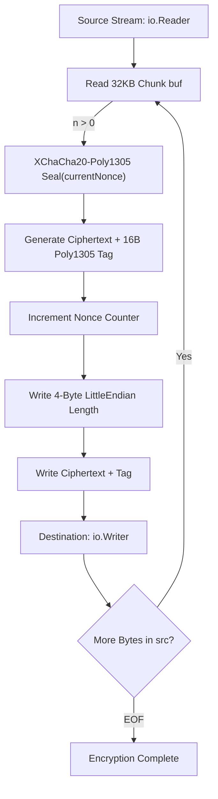
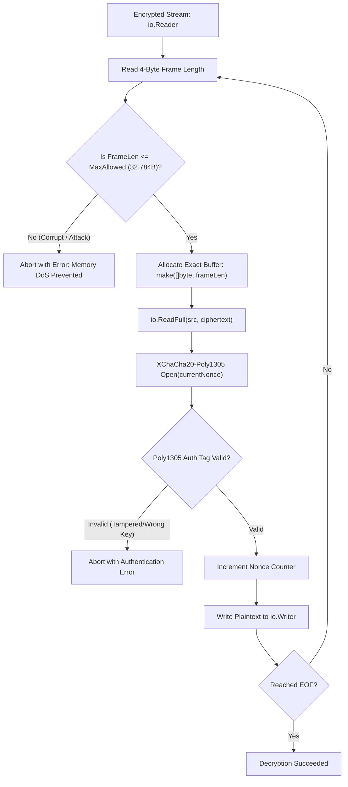
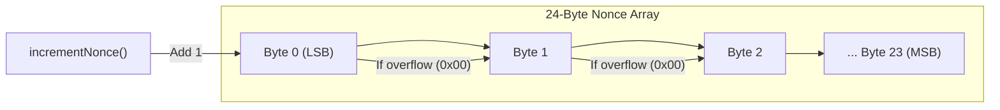

# GO-DFS Crypto Package (`pkg/crypto`)

The `crypto` package provides low-overhead, streaming authenticated encryption and decryption capabilities for **GO-DFS** using the **XChaCha20-Poly1305** AEAD cipher.

It enables transparent end-to-end and at-rest encryption of streams (readers and writers) by breaking payload streams into bounded frames, authenticating each frame individually with Poly1305 tags, and automatically managing per-chunk nonces.

---

## 🏗 Key Features & Architecture

* **Cipher Choice (XChaCha20-Poly1305)**: Uses `golang.org/x/crypto/chacha20poly1305.NewX` with an extended 192-bit (24-byte) nonce.
* **Why 24-byte Nonce instead of 12-byte?**: Standard ChaCha20 uses a 12-byte (96-bit) nonce. In distributed storage with thousands of replicated files and chunks, generating random 12-byte nonces hits the Birthday Bound collision risk around $2^{32}$ chunks. The 24-byte nonce provides a massive nonce space ($2^{192}$), making collisions mathematically impossible under random generation.
* **Streaming & Chunking**: Processes arbitrarily large `io.Reader` sources into `io.Writer` destinations in fixed **32 KB** plaintext chunks (`MaxFrameSize`), keeping RAM usage tiny (~32 KB) regardless of file size.
* **Framed Serialization**: Encloses each encrypted chunk in a binary frame header (`[4-byte LittleEndian length][ciphertext + 16-byte Poly1305 tag]`).
* **Sequential Nonce Stepping**: Starting from a base 24-byte nonce, the nonce increments monotonically after every frame to ensure no two frames ever share the same nonce under the same key.
* **DoS / Memory Exhaustion Defense**: On decryption, frame lengths are strictly validated against `MaxFrameSize + aead.Overhead()` before allocating memory, preventing malicious or corrupted streams from triggering Out-of-Memory (OOM) crashes.
* **Key Persistence & Safety**: Provides utility functions to load or generate secure 256-bit symmetric keys with strict file permissions (`0600`).
* **At-Rest vs. In-Transit Separation**:
  - `pkg/crypto`: Focuses on **at-rest file/chunk storage encryption** (using 24-byte nonce XChaCha20-Poly1305 and Little-Endian frame headers).
  - `pkg/p2p/secure.go`: Focuses on **in-transit TCP wire encryption** (using X25519 ephemeral key exchange, HKDF key derivation, 12-byte nonce ChaCha20-Poly1305, and Big-Endian network frame headers).

---

## 📊 Visual Execution Flow & Architecture Diagrams

### 1. Streaming Encryption Pipeline (`Encrypt`)



### 2. Streaming Decryption Pipeline (`Decrypt`)



---

## 📦 Frame Layout (At-Rest Wire Format)

Each frame in the encrypted binary output stream follows this format:

```text
+-----------------------+-------------------------------------------------------+
| Length (4 Bytes)      | Encrypted Payload + Auth Tag (N Bytes)               |
| uint32 (LittleEndian) | (Length - 16 bytes payload, 16 bytes Poly1305 tag)    |
+-----------------------+-------------------------------------------------------+
```

* **Length Header**: 4 bytes (`uint32`, Little-Endian) representing `len(ciphertext + tag)`. Note: Local storage frames use Little-Endian for direct CPU word compatibility.
* **Ciphertext Body**: `n` bytes of encrypted plaintext followed by the 16-byte Poly1305 authentication tag.
* **Max Encrypted Frame Size**: `32,768 bytes (MaxFrameSize) + 16 bytes (AEAD Overhead) = 32,784 bytes`.

---

## 🔄 Nonce Increment Algorithm

The `incrementNonce` function treats the nonce slice as a little-endian multi-byte integer with automated carry propagation:



```go
func incrementNonce(nonce []byte) {
    for i := 0; i < len(nonce); i++ {
        nonce[i]++
        if nonce[i] != 0 {
            break // no carry needed, done
        }
    }
}
```

This ensures that:
1. Every 32 KB frame within a file stream gets a unique nonce.
2. The counter safely cascades carries across byte boundaries if needed.

---

## 🔑 Constants & API Reference

### Constants

| Constant | Value | Description |
| :--- | :--- | :--- |
| `NonceSize` | `24` | Required size in bytes for the XChaCha20 nonce (192 bits). |
| `MaxFrameSize` | `32 * 1024` (32 KB) | Maximum plaintext size processed per frame during streaming. |

### Core Functions

#### [`Encrypt`](file:///c:/UNIVERSE/Projects/GO-DFS/pkg/crypto/crypto.go#L23-L73)
```go
func Encrypt(key []byte, nonce []byte, src io.Reader, dst io.Writer) (int64, error)
```
Reads data sequentially from `src` in chunks up to `MaxFrameSize`, encrypts each chunk using XChaCha20-Poly1305 with `currentNonce`, increments `currentNonce`, and writes the framing length header and ciphertext to `dst`. Returns the total number of bytes written to `dst`.

#### [`Decrypt`](file:///c:/UNIVERSE/Projects/GO-DFS/pkg/crypto/crypto.go#L75-L132)
```go
func Decrypt(key []byte, nonce []byte, src io.Reader, dst io.Writer) (int64, error)
```
Reads binary frames sequentially from `src`, validates frame length against `maxAllowed`, decrypts and authenticates ciphertext using XChaCha20-Poly1305 with `currentNonce`, increments `currentNonce`, and writes decrypted plaintext to `dst`. Returns the total plaintext bytes written to `dst`.

#### [`LoadOrGenerateKey`](file:///c:/UNIVERSE/Projects/GO-DFS/pkg/crypto/crypto.go#L144-L162)
```go
func LoadOrGenerateKey(filename string) ([]byte, error)
```
Checks if a 32-byte key file exists at `filename`. If found, reads and returns the key. If missing, generates 32 cryptographically secure random bytes via `crypto/rand`, saves the file with `0600` permissions (owner read/write only), and returns the key.

---

## 💡 Code Examples

### 1. File Encryption and Decryption

```go
package main

import (
	"bytes"
	"crypto/rand"
	"fmt"
	"log"

	"github.com/Ankesh2004/GO-DFS/pkg/crypto"
)

func main() {
	// 1. Generate 32-byte key and 24-byte base nonce
	key := make([]byte, 32)
	nonce := make([]byte, crypto.NonceSize)
	rand.Read(key)
	rand.Read(nonce)

	plaintext := []byte("Hello, GO-DFS streaming encryption!")
	src := bytes.NewReader(plaintext)
	encryptedBuf := new(bytes.Buffer)

	// 2. Encrypt stream
	written, err := crypto.Encrypt(key, nonce, src, encryptedBuf)
	if err != nil {
		log.Fatalf("Encryption failed: %v", err)
	}
	fmt.Printf("Encrypted %d bytes into stream\n", written)

	// 3. Decrypt stream using original key and nonce
	decryptedBuf := new(bytes.Buffer)
	_, err = crypto.Decrypt(key, nonce, encryptedBuf, decryptedBuf)
	if err != nil {
		log.Fatalf("Decryption failed: %v", err)
	}

	fmt.Printf("Decrypted message: %s\n", decryptedBuf.String())
}
```

### 2. Loading or Generating Persistent Keys

```go
key, err := crypto.LoadOrGenerateKey("dfs.key")
if err != nil {
    log.Fatalf("Failed to manage key: %v", err)
}
```

---

## 🛡 Security Considerations

1. **Nonce Uniqueness**: Nonces MUST NOT be reused across different streams under the same secret key. Because XChaCha20 uses a 192-bit nonce space, nonces generated using `crypto/rand` have virtually zero collision risk.
2. **Authentication & Tamper Resistance**: Poly1305 authentication tags guarantee that altered or corrupted frames are rejected during `Decrypt` before any unauthenticated plaintext is yielded.
3. **Bounded Allocations**: Prior to reading ciphertexts, `Decrypt` enforces strict upper limits on frame length (`frameLen <= 32,784 bytes`), guarding against heap exhaustion attacks caused by corrupt stream headers.
4. **Key File Permissions**: `LoadOrGenerateKey` uses `0600` permissions so other non-root OS users cannot read the private key file.

---

## 🧪 Testing

Unit tests for `pkg/crypto` are located in [`crypto_test.go`](file:///c:/UNIVERSE/Projects/GO-DFS/pkg/crypto/crypto_test.go).

Run the tests using standard Go commands:

```bash
go test -v ./pkg/crypto/...
```

Test cases cover:
* **Roundtrip verification**: Verifying encryption and decryption consistency.
* **Empty payloads**: Handling 0-byte stream inputs.
* **Multi-chunk & Large streams**: Validating streaming performance across 1MB+ payloads.
* **AEAD Tag validation**: Confirming decryption failure when an incorrect key or corrupted ciphertext is supplied.

