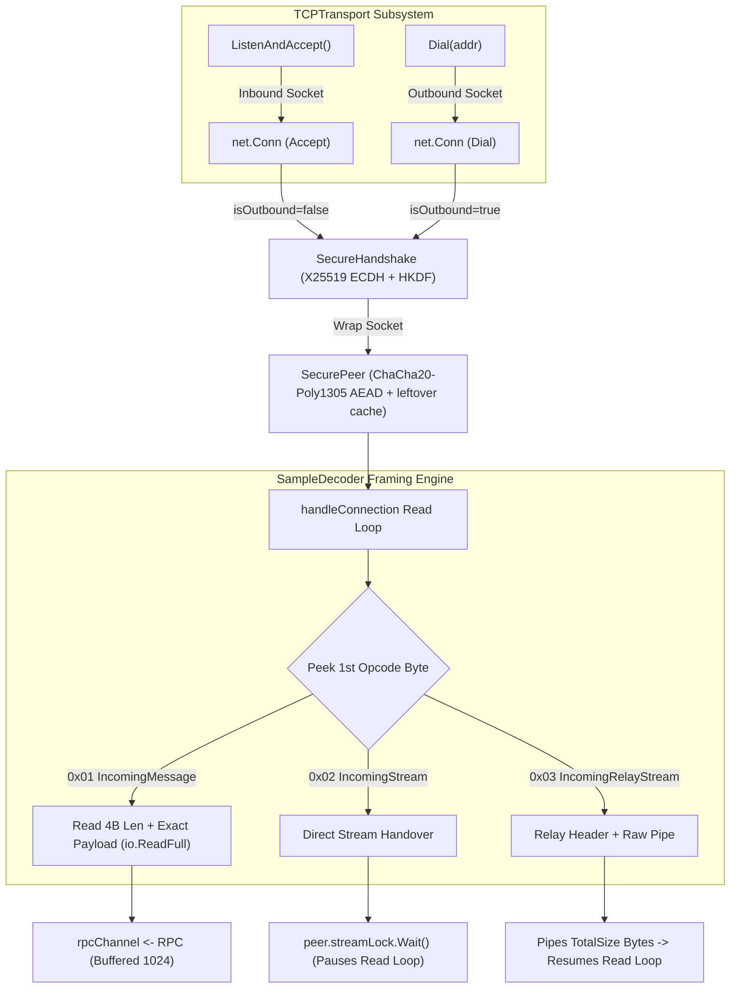
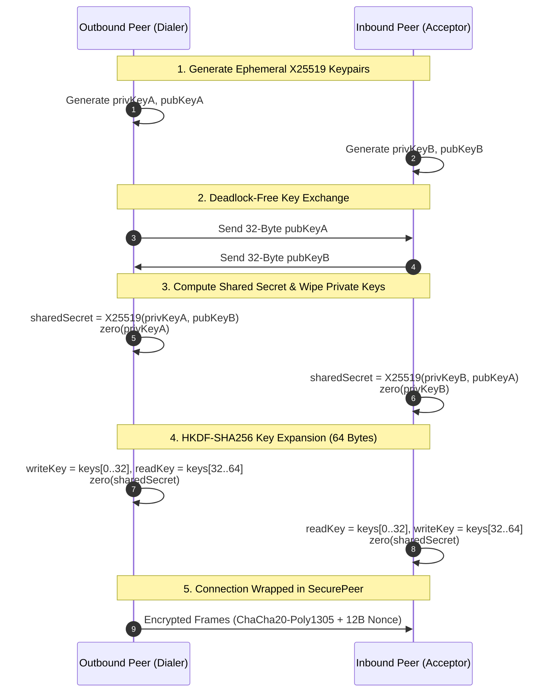
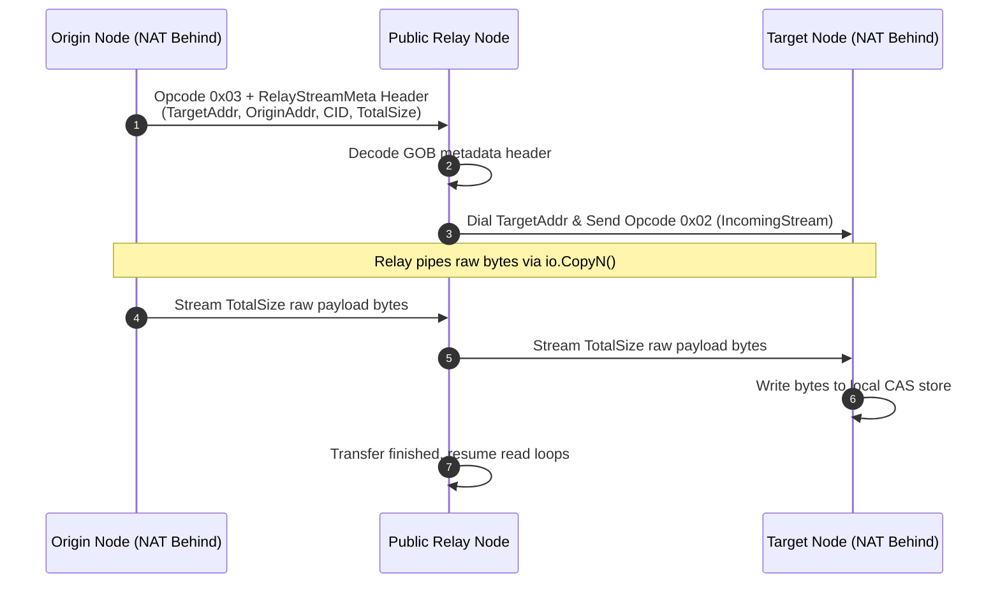

# `p2p` — P2P Transport & Security Layer

The `p2p` package provides the low-level peer-to-peer networking foundation for **GO-DFS** (Go Distributed File System). It manages TCP connection lifecycles, cryptographic handshakes, authenticated wire encryption, stream synchronization, socket reuse, and deterministic protocol message framing/demuxing.

---

## Key Features & Architecture

- **Decoupled Transport Abstractions**: Clean Go interfaces ([`Peer`](file:///c:/UNIVERSE/Projects/GO-DFS/pkg/p2p/transport.go#L7-L11) and [`Transport`](file:///c:/UNIVERSE/Projects/GO-DFS/pkg/p2p/transport.go#L14-L20)) allowing pluggable transport implementations (TCP, QUIC, etc.).
- **Ephemeral X25519 Key Agreement**: Ephemeral Elliptic-Curve Diffie-Hellman (ECDH) handshake per connection with zero persistent key exposure.
- **Deadlock-Free Asymmetric Handshake**: Outbound dialing peers write their public key first; inbound accepting peers read first. This eliminates simultaneous read deadlocks over raw TCP sockets.
- **ChaCha20-Poly1305 AEAD Wire Encryption**: Authenticated Encryption with Associated Data (AEAD) wrapping underlying `net.Conn` streams to enforce confidentiality and immediate tamper detection.
- **Direction-Separated HKDF Keys**: Independent 32-byte read and write keys derived via HKDF-SHA256 from the ECDH shared secret to prevent reflection and replay attacks.
- **Immediate Memory Zeroization**: Ephemeral private keys and raw shared secrets are wiped from RAM using [`zero([]byte)`](file:///c:/UNIVERSE/Projects/GO-DFS/pkg/p2p/secure.go#L260) immediately after key derivation to prevent memory extraction.
- **Partial Read Buffering (`leftover` cache)**: Seamlessly handles cases where higher-level decoders read smaller byte slices than the decrypted AEAD frame by buffering residual plaintext.
- **Stream Synchronization & Demuxing**: Deterministic message framing (`SampleDecoder`) with `sync.WaitGroup` stream handover locks that prevent the RPC decoding loop from corrupting raw chunk file transfers.
- **Relay Stream Support**: Integrated header decoding for piped data transfers across relay nodes.
- **Cross-Platform Socket Reuse**: Platform-specific socket configuration (`SO_REUSEADDR` / `SO_REUSEPORT`) via `syscall.RawConn` on Windows and Unix-like operating systems to eliminate "address already in use" errors during cluster restart.

---

## Core Architecture & Execution Flow



```text
+-------------------------------------------------------------------------------+
|                                  TCPTransport                                 |
|                                                                               |
|   +-----------------------+                    +--------------------------+   |
|   |  ListenAndAccept()    |                    |        Dial(addr)        |   |
|   +-----------+-----------+                    +------------+-------------+   |
|               |                                             |                 |
+---------------+---------------------------------------------+-----------------+
                | (Inbound)                                   | (Outbound)
                v                                             v
        [Inbound TCPConn]                             [Outbound TCPConn]
                | (Reads pubKey first)                        | (Sends pubKey first)
                +----------------------+----------------------+
                                       |
                                       v
                             +--------------------+
                             |  SecureHandshake   |
                             |  (X25519 + HKDF)   |
                             |  zero(privKey)     |
                             +---------+----------+
                                       |
                                       v
                             +--------------------+
                             |     SecurePeer     |
                             | (ChaCha20-Poly1305)|
                             | [leftover buffer]  |
                             +---------+----------+
                                       |
                                       v
                             +--------------------+
                             |   SampleDecoder    |
                             | (Framed RPC Loop)  |
                             +---------+----------+
                                       |
                        +--------------+--------------+
                        |                             |
                        v                             v
               [IsStream / IsRelay]              [RPC Message]
                        |                             |
                        v                             v
               Stream WaitGroup Lock            rpcChannel <- rpc
               (peer.streamLock.Wait())
```

---

## Connection Lifecycle & Handshake Mechanics

### 1. Connection Establishment & Socket Configuration
[`TCPTransport`](file:///c:/UNIVERSE/Projects/GO-DFS/pkg/p2p/tcp.go#L73) listens for incoming TCP connections or dials remote nodes. It configures socket options via `setSocketReuseAddr` ([`socket_windows.go`](file:///c:/UNIVERSE/Projects/GO-DFS/pkg/p2p/socket_windows.go) / [`socket_unix.go`](file:///c:/UNIVERSE/Projects/GO-DFS/pkg/p2p/socket_unix.go)) to enable immediate port reuse upon rapid node restarts.

### 2. Ephemeral Key Exchange (`SecureHandshake`) Sequence


```go
// 1. Generate ephemeral X25519 keypair
var privKey [32]byte
rand.Read(privKey[:])
pubKey, _ := curve25519.X25519(privKey[:], curve25519.Basepoint)

// 2. Exchange public keys deterministically
if tcpPeer.isOutbound {
    tcpPeer.Conn.Write(pubKey)
    io.ReadFull(tcpPeer.Conn, peerPubKey)
} else {
    io.ReadFull(tcpPeer.Conn, peerPubKey)
    tcpPeer.Conn.Write(pubKey)
}

// 3. Compute ECDH shared secret and wipe private key
sharedSecret, _ := curve25519.X25519(privKey[:], peerPubKey)
zero(privKey[:])

// 4. Derive directional 32-byte keys via HKDF-SHA256
hkdfReader := hkdf.New(sha256.New, sharedSecret, nil, []byte("go-dfs-secure-transport"))
keyMaterial := make([]byte, 64)
io.ReadFull(hkdfReader, keyMaterial)
zero(sharedSecret)
```

- **Asymmetric Directional Pairing**:
  - Outbound peer: `writeKey = keyMaterial[:32]`, `readKey = keyMaterial[32:]`
  - Inbound peer: `readKey = keyMaterial[:32]`, `writeKey = keyMaterial[32:]`
  This guarantees `outbound.writeKey == inbound.readKey` while eliminating reflection attacks.
- **Connection Wrapping**: The raw `net.Conn` inside [`TCPPeer`](file:///c:/UNIVERSE/Projects/GO-DFS/pkg/p2p/tcp.go#L14) is replaced with an encrypted [`SecurePeer`](file:///c:/UNIVERSE/Projects/GO-DFS/pkg/p2p/secure.go#L24).

---

## Wire Protocol & Frame Formats

### 1. In-Transit Encrypted Frame Format (`SecurePeer`)

All encrypted network communications over `SecurePeer` use Big-Endian length-prefix framing:

```text
+-------------------------------+-----------------------------------+--------------------+
| Length (4 Bytes, Big-Endian)  | Encrypted Ciphertext (Up to 16KB) | Poly1305 Tag (16B) |
+-------------------------------+-----------------------------------+--------------------+
```

| Field | Size | Description |
| :--- | :--- | :--- |
| `Length` | 4 bytes (`uint32`, Big-Endian) | Total byte length of subsequent ciphertext + tag |
| `Ciphertext` | $N$ bytes (Max 16 KB plaintext) | Encrypted payload + 16-byte Poly1305 authentication tag |

* **Nonce Stepping**: Each frame increments a 12-byte nonce (little-endian order) independently for write (`encNonce`) and read (`decNonce`) channels.
* **Partial Read Buffering**: If the upper layer requests a 1 KB buffer, `SecurePeer.Read()` decrypts the full frame, fills the 1 KB slice, and stores residual bytes in `s.leftover`.

### 2. High-Level Protocol Message Types (`message.go` & `encoding.go`)

The high-level protocol inspects the first byte of incoming plaintext:

| Type Identifier | Byte Flag | RPC Field Set | Description |
| :--- | :--- | :--- | :--- |
| `IncomingMessage` | `0x01` | `Payload` | Normal message carrying bounded byte data (capped at 2 MB). |
| `IncomingStream` | `0x02` | `IsStream = true` | Signals a raw stream handover for direct peer-to-peer file transfers. |
| `IncomingRelayStream` | `0x03` | `IsRelay = true`, `RelayMeta` | Signals a relayed stream with metadata header preceding the raw payload. |

#### Message Frame Structure (`0x01`)
```text
[0x01 (1 byte)] + [Length (4 bytes, Little-Endian)] + [Payload (N bytes)]
```

#### Relay Stream Header Frame Structure (`0x03`)
```text
[0x03 (1 byte)] + [Header Len (4 bytes, Little-Endian)] + [GOB-encoded RelayStreamMeta] + [Raw Data Bytes...]
```

---

## Stream Synchronization & Race Prevention

```mermaid
sequenceDiagram
    autonumber
    participant Net as TCP Socket
    participant Loop as handleConnection (Read Loop)
    participant Worker as File Server / Storage Worker

    Net->>Loop: Receives Opcode 0x02 (IncomingStream)
    Loop->>Loop: tcpPeer.Wg.Add(1)<br/>tcpPeer.streamActive = true
    Loop->>Worker: Delivers rpc (rpc.IsStream = true)
    Note over Loop: Loop calls tcpPeer.Wg.Wait()<br/>READ LOOP PAUSED
    Worker->>Net: io.Copy(casStore, peer.Conn)<br/>Reads raw 8MB chunk directly
    Worker->>Loop: peer.CloseStream() -> tcpPeer.Wg.Done()
    Note over Loop: Wg.Wait() unblocks!<br/>READ LOOP RESUMES
    Net->>Loop: Receives next opcode (0x01 or 0x02)
```

When transferring large file chunks:
1. `SampleDecoder` reads opcode `0x02` (`IncomingStream`) and sets `rpc.IsStream = true`.
2. `handleConnection` in [`tcp.go`](file:///c:/UNIVERSE/Projects/GO-DFS/pkg/p2p/tcp.go#L37-L45) calls `peer.streamLock.Add(1)` and delivers the RPC to the consumer.
3. The connection read loop **pauses and blocks** on `peer.streamLock.Wait()`.
4. The file storage worker streams the raw chunk bytes directly from `peer.Conn` into the CAS store without frame decoding interference.
5. Once the stream is fully consumed, `peer.CloseStream()` calls `peer.streamLock.Done()`, resuming the normal RPC decoding loop.

---

## 🔀 Multi-Hop Relay Streaming (`0x03`)



---

## Key Interfaces & Types

### [`Peer`](file:///c:/UNIVERSE/Projects/GO-DFS/pkg/p2p/transport.go#L7-L11)
```go
type Peer interface {
    net.Conn
    Send([]byte) error
    CloseStream() error
}
```
Represents a remote node connection. Wraps network I/O, stream locking, and write operations.

### [`Transport`](file:///c:/UNIVERSE/Projects/GO-DFS/pkg/p2p/transport.go#L14-L20)
```go
type Transport interface {
    Addr() string
    Dial(addr string) error
    ListenAndAccept() error
    Consume() <-chan RPC
    Close() error
}
```
High-level network transport interface for connection lifecycle management and RPC consumption.

### [`SecurePeer`](file:///c:/UNIVERSE/Projects/GO-DFS/pkg/p2p/secure.go#L24-L33)
```go
type SecurePeer struct {
    net.Conn
    enc      cipher.AEAD
    dec      cipher.AEAD
    encNonce []byte
    decNonce []byte
    leftover []byte
    writeMu  sync.Mutex
    readMu   sync.Mutex
}
```
Transparent `net.Conn` wrapper enforcing ChaCha20-Poly1305 AEAD frame encryption, decryption, nonce stepping, and partial read buffering.

### [`SampleDecoder`](file:///c:/UNIVERSE/Projects/GO-DFS/pkg/p2p/encoding.go#L25-L26)
Decoder implementation handling precise byte-boundary reading for message payloads, direct stream signals, and relay metadata.

---

## Security Specifications

1. **Perfect Forward Secrecy**: Handshakes generate fresh ephemeral X25519 keypairs per connection.
2. **Key Isolation**: HKDF-SHA256 derives distinct 256-bit read and write keys per endpoint.
3. **Integrity & Authenticity**: ChaCha20-Poly1305 AEAD detects bit-flips and data tampering. Authentication failure triggers an immediate connection close.
4. **Memory Security**: Ephemeral private keys and intermediate HKDF materials are zeroed out via [`zero([]byte)`](file:///c:/UNIVERSE/Projects/GO-DFS/pkg/p2p/secure.go#L260) immediately after derivation.
5. **DoS Mitigation**:
   - `MaxMessageSize` is restricted to `2 MB` for standard RPC payloads.
   - `maxFrameSize` caps plaintext frame size to `16 KB`.
   - Relay header length check caps metadata headers at `64 KB`.

---

## File Summary

| File | Description |
| :--- | :--- |
| [`transport.go`](file:///c:/UNIVERSE/Projects/GO-DFS/pkg/p2p/transport.go) | Defines top-level [`Peer`](file:///c:/UNIVERSE/Projects/GO-DFS/pkg/p2p/transport.go#L7) and [`Transport`](file:///c:/UNIVERSE/Projects/GO-DFS/pkg/p2p/transport.go#L14) interfaces. |
| [`tcp.go`](file:///c:/UNIVERSE/Projects/GO-DFS/pkg/p2p/tcp.go) | Implementation of [`TCPTransport`](file:///c:/UNIVERSE/Projects/GO-DFS/pkg/p2p/tcp.go#L73) and [`TCPPeer`](file:///c:/UNIVERSE/Projects/GO-DFS/pkg/p2p/tcp.go#L14) with connection loops and stream synchronization. |
| [`secure.go`](file:///c:/UNIVERSE/Projects/GO-DFS/pkg/p2p/secure.go) | Handshake logic ([`SecureHandshake`](file:///c:/UNIVERSE/Projects/GO-DFS/pkg/p2p/secure.go#L148)), X25519 key exchange, HKDF key derivation, and [`SecurePeer`](file:///c:/UNIVERSE/Projects/GO-DFS/pkg/p2p/secure.go#L24) AEAD encryption wrapper. |
| [`handshake.go`](file:///c:/UNIVERSE/Projects/GO-DFS/pkg/p2p/handshake.go) | Defines the [`Handshake`](file:///c:/UNIVERSE/Projects/GO-DFS/pkg/p2p/handshake.go#L6) function signature and sample pass-through handshake. |
| [`message.go`](file:///c:/UNIVERSE/Projects/GO-DFS/pkg/p2p/message.go) | Defines [`RPC`](file:///c:/UNIVERSE/Projects/GO-DFS/pkg/p2p/message.go#L17) structure, [`RelayStreamMeta`](file:///c:/UNIVERSE/Projects/GO-DFS/pkg/p2p/message.go#L9) structure, and protocol message constants (`0x01`, `0x02`, `0x03`). |
| [`encoding.go`](file:///c:/UNIVERSE/Projects/GO-DFS/pkg/p2p/encoding.go) | Implementations of [`Decoder`](file:///c:/UNIVERSE/Projects/GO-DFS/pkg/p2p/encoding.go#L12) ([`SampleDecoder`](file:///c:/UNIVERSE/Projects/GO-DFS/pkg/p2p/encoding.go#L25), [`GOBDecoder`](file:///c:/UNIVERSE/Projects/GO-DFS/pkg/p2p/encoding.go#L17)) and byte stream framing mechanisms. |
| [`socket_windows.go`](file:///c:/UNIVERSE/Projects/GO-DFS/pkg/p2p/socket_windows.go) | Windows-specific socket option configuration (`SO_REUSEADDR`). |
| [`socket_unix.go`](file:///c:/UNIVERSE/Projects/GO-DFS/pkg/p2p/socket_unix.go) | Unix/Linux/macOS socket option configuration (`SO_REUSEADDR`, `SO_REUSEPORT`). |
| [`secure_test.go`](file:///c:/UNIVERSE/Projects/GO-DFS/pkg/p2p/secure_test.go) | Comprehensive unit tests covering key agreement, tamper detection, and large payload (10 MB) encrypted transfers. |

